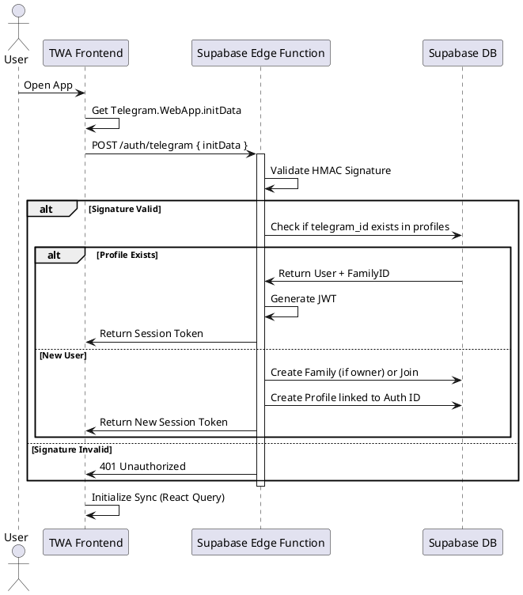
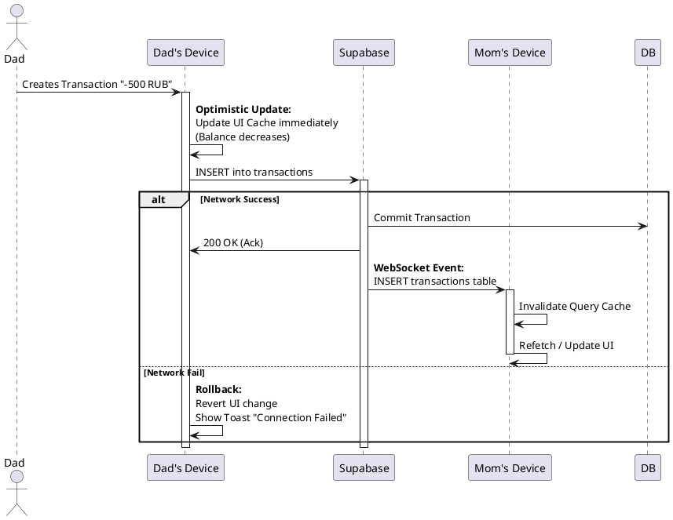

# Architectural Design Record (ADR) 001: Cloud Infrastructure & Synchronization

**Status:** APPROVED  
**Date:** 2024-05-22  
**Author:** Senior Product Architect  
**Target Feature:** Cloud Sync & Real-time Collaboration

---

## 1. Context & Problem Statement

Currently, **Family OS** operates as a single-player application using `localStorage`.
**Limitations:**
1.  **Data Silos:** Data created by one family member is invisible to others.
2.  **Data Loss:** Clearing browser cache wipes all family data.
3.  **Security:** No role validation; any user can switch profiles locally.

**Goal:** Implement a robust backend infrastructure to enable multi-user access, real-time synchronization across devices, and secure data persistence, while maintaining the "snappy" feel of a local app.

---

## 2. Decision: Supabase (BaaS)

We will utilize **Supabase** as the backend infrastructure.

### Justification
1.  **PostgreSQL:** Essential for financial data integrity (ACID transactions).
2.  **Realtime:** Built-in WebSocket support (Postgres Changes) allows instant UI updates without writing a custom socket server.
3.  **Auth:** Seamless integration with Telegram Web App (TWA) authentication.
4.  **Speed:** Drastically reduces boilerplate code compared to a custom Go/Node.js backend.

### Tech Stack Updates
*   **Database:** PostgreSQL 15+ (Managed by Supabase).
*   **API Client:** `@supabase/supabase-js`.
*   **State Management:** Migrate from raw `useAppStore` to **TanStack Query (React Query)** for server state management + Optimistic Updates.
*   **Auth:** Telegram `initData` signature validation via Edge Functions.

---

## 3. Data Architecture (Schema Design)

We need to migrate the loose JSON structure to strict SQL tables with Row Level Security (RLS).

### Entity Relationship Diagram (Textual)

All tables must have a `family_id` column to enforce multi-tenancy.

```sql
-- 1. FAMILIES (Tenancy Unit)
create table families (
  id uuid primary key default gen_random_uuid(),
  name text not null,
  created_at timestamptz default now()
);

-- 2. USERS (Profiles)
create table profiles (
  id uuid primary key references auth.users(id), -- Links to Supabase Auth
  family_id uuid references families(id),
  telegram_id bigint unique,
  username text,
  full_name text,
  avatar text,
  role text check (role in ('OWNER', 'ADMIN', 'CHILD')),
  xp integer default 0,
  level integer default 1
);

-- 3. ACCOUNTS (Finance)
create table accounts (
  id uuid primary key default gen_random_uuid(),
  family_id uuid references families(id),
  name text not null,
  balance bigint default 0, -- Stored in cents
  type text check (type in ('CARD', 'CASH', 'SAVINGS')),
  visible_to uuid[] -- Array of user_ids who can see this
);

-- 4. TRANSACTIONS
create table transactions (
  id uuid primary key default gen_random_uuid(),
  family_id uuid references families(id),
  account_id uuid references accounts(id),
  amount bigint not null,
  type text check (type in ('INCOME', 'EXPENSE', 'TRANSFER')),
  category_id text,
  title text,
  date timestamptz default now(),
  created_by uuid references profiles(id)
);

-- 5. TASKS
create table tasks (
  id uuid primary key default gen_random_uuid(),
  family_id uuid references families(id),
  title text not null,
  status text default 'TODO',
  priority text,
  points integer default 0,
  assignee_id uuid references profiles(id),
  epic_id uuid, -- foreign key to epics
  due_date date,
  is_recurring boolean default false,
  frequency text
);
```

### Security (RLS Policies)

Every table must have RLS enabled.
*   **Select:** `auth.uid() in (select id from profiles where family_id = current_table.family_id)`
*   **Insert/Update:** Same check.

---

## 4. Integration Workflows

### A. Authentication & Bootstrapping (Sequence Diagram)

How a user logs in via Telegram and gets mapped to a family.



### B. Real-time Sync & Optimistic Updates

How we ensure the UI feels instant even on bad 3G networks.



---

## 5. Implementation Guide for Developers

### Phase 1: Client-Side Preparation
1.  **Replace ID Generation:** Stop using `Math.random()`. Use `uuid` library (v4) on frontend. This allows generating IDs locally that are valid in Postgres.
2.  **API Layer Abstraction:** Create a `services/api.ts` file.
    *   Move all logic from `store.ts` actions to API calls.
    *   Example: `actions.finance.saveTransaction` -> `api.transactions.create(data)`.
3.  **React Query Setup:**
    *   Wrap `App` in `QueryClientProvider`.
    *   Create hooks: `useTasks()`, `useTransactions()`.
    *   Implement `useMutation` with `onMutate` for optimistic updates.

### Phase 2: Backend Setup
1.  Initialize Supabase project.
2.  Run SQL migration scripts (Schema defined in Section 3).
3.  Deploy Edge Function for Telegram Auth.

### Phase 3: Data Migration
1.  On first launch with new version, check `localStorage`.
2.  If data exists AND user is logged in:
    *   Show "Syncing your data..." loader.
    *   Bulk insert local data into Supabase.
    *   Clear `localStorage` (or mark as migrated).

---

## 6. Definition of Done (DoD)
*   [ ] User can login via Telegram.
*   [ ] User A creates a task, User B sees it appear instantly (<1s) without refresh.
*   [ ] RLS prevents User A from seeing User C's family data.
*   [ ] App works (read-only) if internet is disconnected, syncs on reconnect.
*   [ ] "Finance" totals match exactly across devices.
