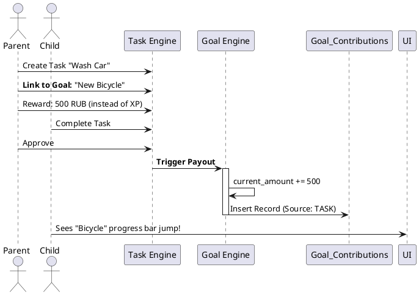
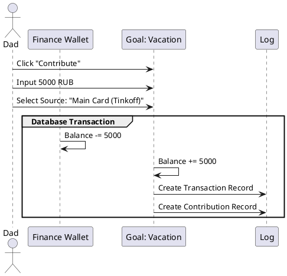

# Architectural Design Record (ADR) 002: Collaborative Savings Goals ("Dream Jars")

**Status:** PROPOSED
**Date:** 2024-05-25
**Author:** Senior Product Architect
**Target Feature:** Financial Literacy & Long-term Motivation

---

## 1. Context & Problem Statement

### The Gap
Currently, **Family OS** handles two extremes of the time spectrum:
1.  **Short-term:** Daily Tasks (Do chores -> Get XP).
2.  **Immediate:** Shop Rewards (Spend XP -> Get Pizza/Game time).

There is no mechanism for **Medium/Long-term planning**.
*   **Scenario:** A child wants a new Bicycle (15,000 RUB).
*   **Current State:** The parent has to mentally track this or create a generic "Account" in the Finance tab, which feels like a spreadsheet, not a game.
*   **Missing Lesson:** The app fails to teach the value of *saving* and *compound effort* (family chipping in).

### The Goal
Create a **"Dream Jar" (Вишлист/Копилка)** system where:
1.  Family members can create shared financial goals.
2.  Tasks can be linked directly to goals (earnings go to the Jar, not the Wallet).
3.  Visual progress motivates users to continue working.

---

## 2. Strategic Decision: Decoupling Goals from Accounts

In the current MVP (`v1.0`), a `FinancialGoal` is strictly tied to a real `Account` (e.g., a Tinkoff Savings Account). This is too rigid for a family setting.

### Decision
We will introduce a **Virtual Goal Entity** that acts as a logical container for funds, independent of where the money physically sits.

*   **Virtual:** For a child's "LEGO Set", the money doesn't exist in a bank yet. It's a promise from the parents.
*   **Physical:** For "Vacation", the goal can be linked to a real bank account for auto-sync (future feature).

---

## 3. Data Architecture

### 3.1. Schema Updates

We need to refactor the existing `FinancialGoal` and add a Contribution log.

```sql
-- Modified Goals Table
create table savings_goals (
  id uuid primary key default gen_random_uuid(),
  family_id uuid references families(id),
  owner_id uuid references profiles(id), -- Who wants this? (Child)
  
  title text not null,
  description text,
  image_url text, -- Visual motivation is key
  
  target_amount bigint not null, -- In cents
  current_amount bigint default 0,
  
  status text check (status in ('ACTIVE', 'PAUSED', 'COMPLETED', 'ARCHIVED')),
  deadline timestamptz,
  
  -- Optional link to real account
  linked_account_id uuid references accounts(id),
  
  created_at timestamptz default now()
);

-- New Table: Contributions
create table goal_contributions (
  id uuid primary key default gen_random_uuid(),
  goal_id uuid references savings_goals(id),
  contributor_id uuid references profiles(id), -- Who paid? (Parent or Child via XP conversion)
  
  amount bigint not null,
  message text, -- e.g., "Birthday gift!", "From chores"
  
  source_type text check (source_type in ('DIRECT', 'TASK_PAYOUT', 'XP_CONVERSION')),
  source_ref_id uuid, -- ID of the Task or Transaction
  
  created_at timestamptz default now()
);
```

### 3.2. XP to Money Conversion (The "Exchange Rate")

To make this work for children who only earn XP:
We need a **Family Config** setting: `xp_to_currency_rate`.
*   *Example:* 10 XP = 1 RUB.
*   Child has 1000 XP. They can "Donate" 1000 XP to the Goal.
*   System deducts 1000 XP from User.
*   System adds 100 RUB (Virtual) to the Goal `current_amount`.

---

## 4. Integration Flows

### 4.1. The "Work for Dream" Flow (Task Linkage)

Instead of earning XP to a general wallet, a task can be "Sponsored".



### 4.2. Direct Contribution Flow



---

## 5. UI/UX Specifications

### 5.1. The "Dream Jar" Component
*   **Visual:** A jar filling up with liquid/coins or a circular progress bar.
*   **States:**
    *   *0-99%:* Show percentage and "Amount left".
    *   *100%:* Confetti animation, "Claim Reward" button appears.
*   **Interaction:** Tapping the jar shows the "History of Contributions" (Who helped?).

### 5.2. Dashboard Widget
*   Show the *High Priority* goal directly on the Dashboard (replacing one of the summary cards or adding a new row).
*   "You are 15% closer to your Bicycle!"

### 5.3. Finance Tab Update
*   Split Finance into two sub-views:
    1.  **Wallet (Liquid):** Current accounts, daily transactions.
    2.  **Dreams (Illiquid):** Grid of Savings Goals.

---

## 6. Technical Implementation Steps (Frontend)

1.  **Model Update (`finance.model.ts`):**
    *   Decouple `FinancialGoal` interface.
    *   Add `GoalContribution` interface.
2.  **Store Actions (`store.ts`):**
    *   `addGoal(goal)`
    *   `contributeToGoal(goalId, amount, source)`
    *   `withdrawFromGoal(goalId)` (If needed to raid the piggy bank).
3.  **UI Components:**
    *   `GoalCard`: The visual representation.
    *   `ContributionModal`: Input amount + Message.
4.  **Gamification:**
    *   Add sound effect (Coins clinking) when contribution is added.

---

## 7. Future Considerations (v2.0)
*   **Crowdfunding:** Generate a public link so Grandparents can contribute to the goal via generic web page (Stripe/payment integration).
*   **Auto-Save:** "Round up" logic on expense transactions (spend 150, deduct 200, put 50 in goal).

